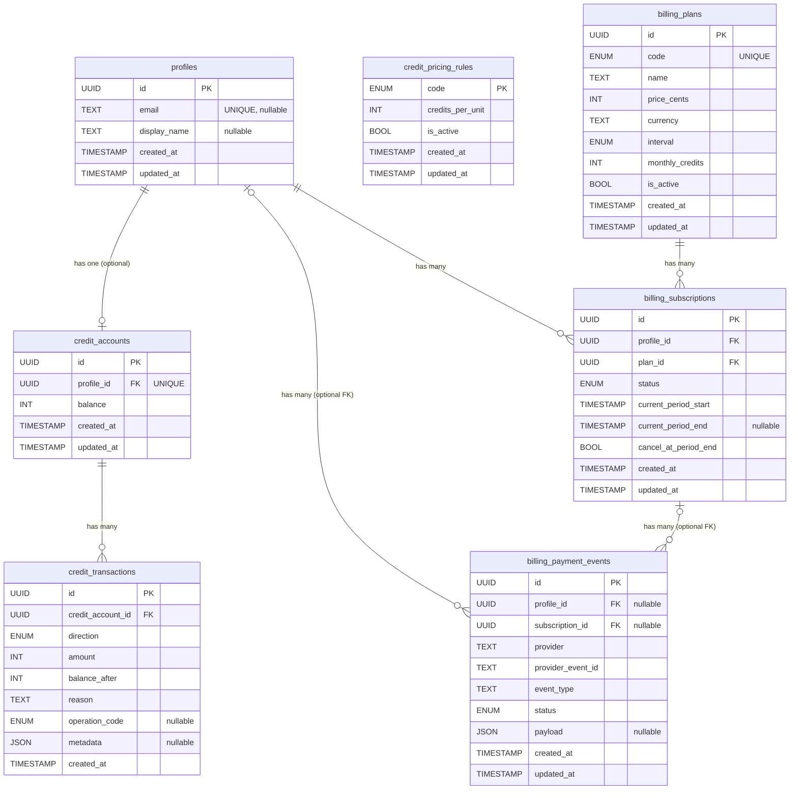

# Database ERD

Source of truth: `prisma/schema.prisma` (note: `src/lib/server/prisma.ts` only initializes the Prisma client).

## Mermaid ERD

## Relationship Summary

1. `credit_accounts.profile_id -> profiles.id`  
   Cardinality: one `Profile` to zero/one `CreditAccount` (`profile_id` is unique).  
   On delete: `CASCADE`.
2. `credit_transactions.credit_account_id -> credit_accounts.id`  
   Cardinality: one `CreditAccount` to many `CreditTransaction`.  
   On delete: `CASCADE`.
3. `billing_subscriptions.profile_id -> profiles.id`  
   Cardinality: one `Profile` to many `BillingSubscription`.  
   On delete: `CASCADE`.
4. `billing_subscriptions.plan_id -> billing_plans.id`  
   Cardinality: one `BillingPlan` to many `BillingSubscription`.  
   On delete: `RESTRICT`.
5. `billing_payment_events.profile_id -> profiles.id` (nullable)  
   Cardinality: one `Profile` to many `BillingPaymentEvent` (optional link from event side).  
   On delete: `SET NULL`.
6. `billing_payment_events.subscription_id -> billing_subscriptions.id` (nullable)  
   Cardinality: one `BillingSubscription` to many `BillingPaymentEvent` (optional link from event side).  
   On delete: `SET NULL`.

## Notes

- `credit_transactions.operation_code` references the `CreditPricingRuleCode` enum (not a FK table relation).
- `billing_payment_events` has a composite unique constraint on `(provider, provider_event_id)`.
